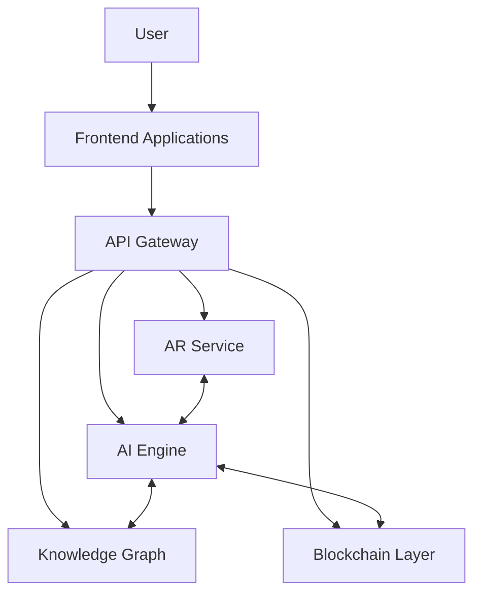
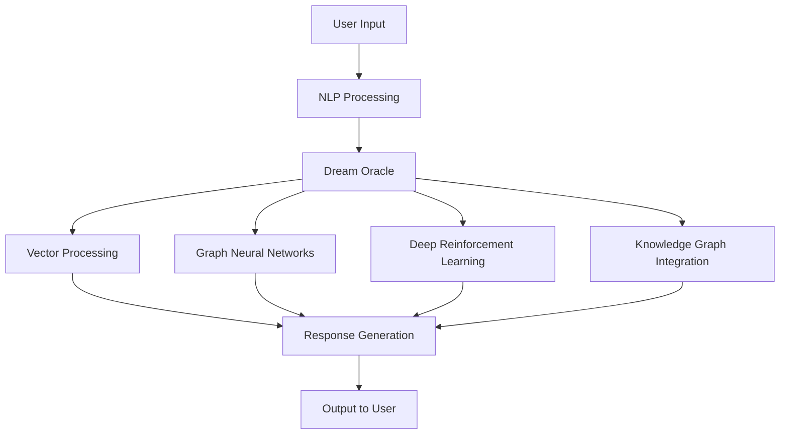
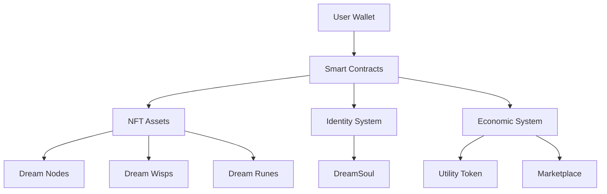
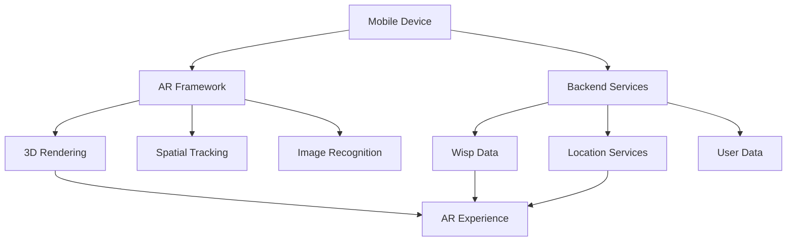
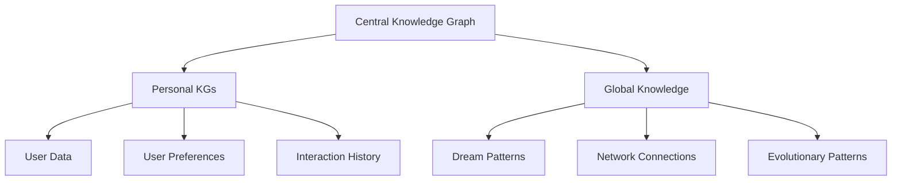
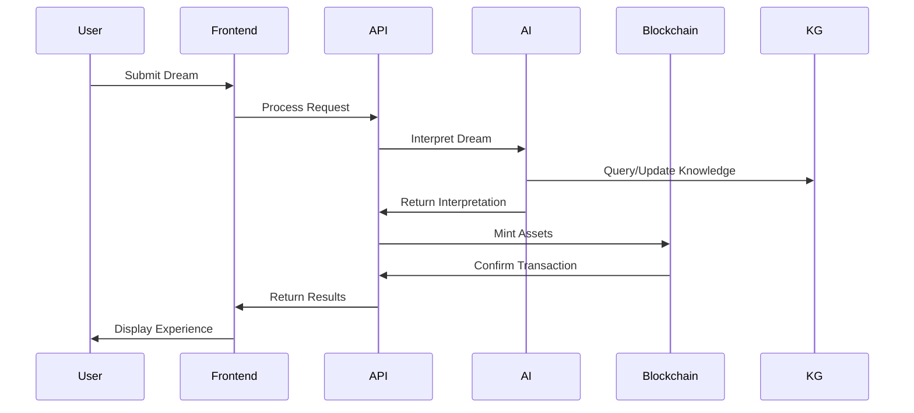

# Overall Architecture Diagrams

## Introduction
This document contains architectural diagrams for the DreamWeaver ecosystem, illustrating the relationships between AI components, blockchain infrastructure, AR integration, and Knowledge Graph structures.

## System Overview



## AI Architecture



## Blockchain Architecture



## AR Integration



## Knowledge Graph Structure



## Data Flow



## Infrastructure Deployment

```mermaid
graph TD
    subgraph User Devices
        Mobile[Mobile Apps]
        Web[Web Interface]
    end

    subgraph Cloud Infrastructure
        API[API Gateway]
        subgraph Compute
            AI[AI Services]
            Backend[Backend Services]
        end
        subgraph Storage
            KG[Neo4j Knowledge Graph]
            Vector[Vector Database]
            Assets[Asset Storage]
        end
    end

    subgraph Blockchain
        Polygon[Polygon Network]
        IPFS[IPFS Storage]
    end

    Mobile --> API
    Web --> API
    API --> Compute
    Compute --> Storage
    Compute --> Blockchain